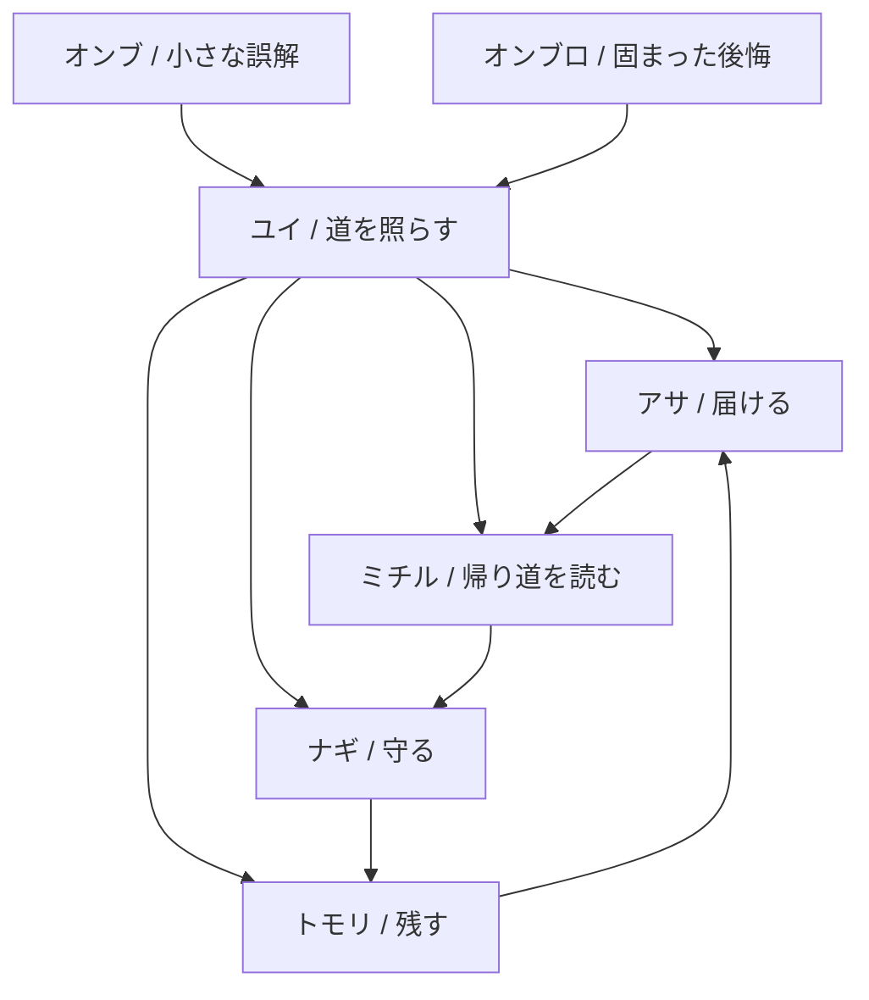

# Character Relationship & Memory Bible

## 目的

Vamp Pon のキャラクター、敵、持ち物、記憶テーマを、20キャラ以上に増えても破綻しないように固定する。

この文書は、以下を決めるための土台である。

```txt
なぜ戦うのか
敵は何なのか
キャラ同士はどう関係するのか
見た目と武器がなぜ被らないのか
被るなら、どんな意味があるのか
記憶を深掘りした時に、なぜワクワクするのか
```

---

# 0. 最重要結論

Vamp Pon は、影を倒すゲームではない。

```txt
忘れられた気持ちを、朝に返すゲーム。
```

敵は悪ではない。

```txt
黒インクに固まった記憶の防衛反応。
```

ユイたちは敵を消しているのではなく、誤解で固まった記憶をほどき、持ち主へ返せる形にしている。

だからハッピーエンドは、勝利ではなく回復になる。

---

# 1. 戦う理由

## 表の理由

```txt
夜の街に黒インク影が出る。
ユイたちは影を払い、記憶の欠片を拾い、朝まで歩く。
```

## 裏の理由

黒インク影は、ただの敵ではない。

```txt
誰かが忘れたもの
誰かが忘れたふりをしたもの
誰かが間違って覚えてしまったもの
誰かが言えなかった言葉
誰かが返せなかった約束
```

が固まったもの。

プレイヤー理解は次の順で進める。

```txt
序盤: 経験値を拾って敵を倒すゲーム
中盤: 拾っているものが誰かの記憶だと分かる
後半: 敵も記憶を守ろうとしていただけだと分かる
終盤: ユイたち自身も、誰かの記憶に残された存在だと分かる
結末: 忘れられたものは、思い出されることで朝へ帰る
```

---

# 2. 敵の正体

## オンブ

小さな黒インク影。

```txt
小さな未練
小さな誤解
言えなかった一言
返せなかった小物
その場だけの寂しさ
```

大量に出してよい。ただし完全な悪意にはしない。

## オンブロ

大きな黒インク影。

```txt
長く残った後悔
家族/友達/旅の分岐
守ろうとして壊してしまった記憶
忘れたくないのに忘れてしまう怖さ
```

オンブロは倒した時に、敵だったものの意味が少し見える。

---

# 3. 初期5人の相関



```txt
ユイ: 入口。誰かの記憶を照らす。
アサ: 届かなかったものを届ける。
ナギ: 開けるべきでないものを守る。
ミチル: 失われたように見える道を読む。
トモリ: 消えそうなものを記録する。
```

5人は仲良し固定ではない。

```txt
助け合う
誤解する
正しさがぶつかる
でも最後は、相手の戦い方にも理由があったと分かる
```

---

# 4. 初期5人の固定設計

## ユイ

```txt
役割: 道を照らす主人公
見た目: フード / 本人の右手にランタン / 右肩から左腰へのバッグ紐 / バッグ本体は左腰
固定武器: 北極星のランタン
得意: 安定 / 防御 / 周囲弱体化 / 初心者向け
不得意: 瞬間火力 / 遠距離殲滅 / 派手なコンボ
記憶テーマ: 拾うこと / 待っていたものに気づくこと / 迷子を放っておけないこと
```

ユイは全員を救う主人公に見えるが、後半で、ユイ自身も誰かに思い出してほしい存在だと分かる。

## アサ

```txt
役割: 届かなかったものを届ける子
見た目: フードなし / 短め外ハネ髪 / 薄いマフラー / 小さな郵便バッグ / 手持ち光なし
固定武器: 紙飛行機
得意: 遠距離 / 直線貫通 / 速度 / 雑魚処理
不得意: 囲まれた時 / ボス単体 / 防御
記憶テーマ: 届けられなかった手紙 / 呼べなかった名前 / 明るく振る舞って隠した寂しさ
```

アサはみんなにあだ名をつける。でもユイだけは本名で呼ぶ。理由は恋愛ではなく、名前を守るため。

## ナギ

```txt
役割: 開けるべきでない記憶を守る子
見た目: 長めの髪 / 帽子なし / 片耳だけの耳飾り / 薄いケープ / 水滴モチーフ / 常時発光なし
固定武器: 雨しずくの針
得意: スロー / 設置 / 継続ダメージ / 状態異常 / 敵の進行制御
不得意: 序盤火力 / 即効性 / 派手さ
記憶テーマ: 閉じた箱 / 言わない優しさ / 読まれると壊れる理由
```

ナギの箱は、秘密を隠すためではない。読む準備ができていない記憶を、黒インクから守るために閉じている。

## ミチル

```txt
役割: 帰り道を読む子
見た目: 探検帽または駅員帽寄り / 三つ編みまたは低いポニーテール / 腰に地図ケース / コンパスは腰側
固定武器: 迷子のコンパス
得意: 追尾 / 誘導 / 敵を集める / 安全地帯作り / 探索補助
不得意: 純火力 / 大型ボス / 押し切られる展開
記憶テーマ: 片方だけの切符 / 読めなくなった帰り道 / 誰の道か分からなくなったこと
```

ミチルは道案内役に見える。でも本当は一番迷いやすい。迷う怖さを知っているから、帰り道にこだわる。

## トモリ

```txt
役割: 消えそうな記憶を残す子
見た目: ランタン禁止 / フード禁止 / 短めボブまたは片側だけ跳ねる髪 / 大きめリボンまたはヘアピン / 手帳 / マッチ箱
固定武器: 記録のマッチ
得意: 高火力 / 爆発 / 炎上 / 短期決戦 / ボス削り
不得意: 防御 / 安定性 / 自傷/暴走リスク / 細かい制御
記憶テーマ: 消えかけた日記 / 燃やしたかった記録 / 残すことと壊すことの境界
```

トモリは乱暴に見える。でも本当は、消えるより焦げてでも残る方がいいと思っている。

---

# 5. 光り物の被り防止

| キャラ | 光/象徴 | 意味 | 表現ルール |
|---|---|---|---|
| ユイ | ランタン | 道を照らす | 常時手持ち光。本人の右手固定。 |
| アサ | 朝焼け/紙 | 届ける | 手持ち光なし。風と白い紙で表現。 |
| ナギ | 水滴/波紋 | 守る | 光らせず、反射と透明感。 |
| ミチル | コンパス/地図 | 帰り道を読む | 金属反射のみ。常時発光なし。 |
| トモリ | マッチ火 | 焼き付ける | 一瞬だけ燃える。ランタン禁止。 |

新キャラに光り物を持たせる場合は、意味を必ず分ける。

```txt
照らす: ユイ専用に近い。原則増やさない。
届ける: 紙、風、朝焼け。手持ち光にしない。
守る: 水、膜、布、影。発光しない。
読む: 金属反射、ガラス、地図。淡く一瞬だけ。
残す: 火、インク、焦げ跡。常時光らない。
祈る: 星、鈴、糸。小さく点滅。
拒む: 黒い光、逆光、穴。敵寄り演出。
```

---

# 6. 20キャラ拡張の枠組み

20キャラは、5つの記憶カテゴリ x 4人で設計する。

```txt
A. 拾う/届ける
B. 守る/隠す
C. 読む/辿る
D. 残す/燃やす
E. 許す/朝へ返す
```

| 枠 | 役割 | 初期代表 | 増やす時の方向 |
|---|---|---|---|
| A | 拾う/届ける | アサ | 手紙、声、贈り物、約束 |
| B | 守る/隠す | ナギ | 箱、傘、鍵、布 |
| C | 読む/辿る | ミチル | 地図、切符、標識、靴 |
| D | 残す/燃やす | トモリ | 日記、写真、マッチ、録音 |
| E | 許す/朝へ返す | ユイ | 灯り、欠片、朝、帰還 |

## 20キャラの空き枠案

| No | 仮役割 | 記憶テーマ | 武器方向 | 見た目差分 |
|---:|---|---|---|---|
| 01 | ユイ | 拾う/照らす | ランタン | フード/旅バッグ |
| 02 | アサ | 届ける | 紙飛行機 | 外ハネ/マフラー |
| 03 | ナギ | 守る | 雨しずくの針 | 長髪/片耳飾り/ケープ |
| 04 | ミチル | 辿る | コンパス | 探検帽/地図ケース |
| 05 | トモリ | 残す | マッチ | ボブ/リボン/手帳 |
| 06 | 声を探す子 | 呼べなかった言葉 | 鈴/音波 | 鈴付き髪紐。光なし。 |
| 07 | 傘を返す子 | 借りたままの傘 | 傘/反射 | 大きな傘。帽子なし。 |
| 08 | 靴跡を読む子 | 途中で消えた足跡 | 靴跡トラップ | 片足だけ違う靴。 |
| 09 | 写真を直す子 | 破れた写真 | 額縁/写真片 | カメラ禁止寄り。写真立て。 |
| 10 | 鍵を預かる子 | 開けない約束 | 鍵束 | 腰鍵。光らない金属。 |
| 11 | 星を数える子 | 待ち合わせの夜 | 星粒 | 帽子なし。髪留めに小星。 |
| 12 | 糸を結ぶ子 | ほどけた約束 | 糸/結界 | 編み込み髪。裁縫道具。 |
| 13 | 時計を止める子 | 間に合わなかった時間 | 懐中時計 | 時計は光らない。秒針演出。 |
| 14 | 花を押す子 | 渡せなかった花 | 押し花 | 花冠禁止。栞。 |
| 15 | 瓶を拾う子 | 流せなかった手紙 | 小瓶/波 | 腰瓶。ナギと水差分注意。 |
| 16 | 窓を開ける子 | 見送れなかった景色 | 窓枠/風 | 窓型盾。アサと風差分注意。 |
| 17 | 黒を写す子 | 覚えてはいけない影 | インク筆 | 片袖黒。敵寄り。 |
| 18 | 毛布をかける子 | 眠れなかった夜 | 布/包む | 大きなショール。フード禁止。 |
| 19 | 砂を払う子 | 埋もれた名前 | 砂時計 | 砂色アクセ。時計枠と差別化。 |
| 20 | 朝を告げる子 | 終わらせる勇気 | 小さな鐘 | 最終章寄り。光でなく音。 |

---

# 7. 関係パターン

全キャラを仲良しにしない。関係は、プレイの組み合わせや合体/覚醒にも使う。

```txt
補完: 得意不得意が噛み合う
衝突: 正しさがぶつかる
誤解: 片方が相手の理由を間違える
保護: 片方が守りすぎる
反転: 嫌っていた行動の意味が後で分かる
```

| 関係 | 表の見え方 | 本当の意味 | ゲーム効果候補 |
|---|---|---|---|
| ユイ x アサ | アサが軽い | 名前を守るために明るくしている | 紙飛行機がランタン範囲で分裂 |
| ユイ x ナギ | ナギが止める | まだ読ませるべきでない記憶を守る | ランタン範囲にスロー雨 |
| ユイ x ミチル | ミチルが案内する | ミチル自身も帰り道を探している | コンパスが欠片へ誘導 |
| ユイ x トモリ | トモリが強引 | 消える前に残したい焦り | ランタン光で炎上延長 |
| アサ x ミチル | 速さと道順で衝突 | 届けるには道が必要 | 紙飛行機が追尾化 |
| ナギ x トモリ | 水と火で衝突 | 守るか残すかの思想差 | 蒸気フィールド |

---

# 8. 新キャラ追加チェックリスト

```txt
名前:
記憶テーマ:
戦う理由:
固定武器:
得意:
不得意:
髪型:
頭装備:
手持ち:
腰/背中装備:
光り物:
ユイとの差分:
既存キャラと被る点:
被る理由:
敵との関係:
ハッピーエンドで何が救われるか:
```

禁止事項:

```txt
理由なしのランタン追加
理由なしのフード追加
全員を光らせる
全員を遠距離型にする
全員を優しい性格にする
全員を悲しい過去持ちにする
```

---

# 9. 実装へ落とす時の優先順位

## P1

```txt
キャラごとの固定武器差分
キャラごとの得意不得意
レベルアップ文言の短い記憶Seed
リザルト文の条件分岐
敵名を感情と結びつける
```

## P2

```txt
キャラ相性による合体/覚醒
敵挙動と記憶テーマの連動
小物防衛/回収ギミック
ステージごとの誤解演出
```

## P3

```txt
20キャラ拡張
関係イベント
図鑑の記憶解放
敵側の救済演出
最終章の朝への帰還
```

---

# 10. 共通説明

```txt
Vamp Pon は、夜に落ちた忘れ物を拾い、黒インクに固まった誤解をほどいて、記憶を朝へ返すゲーム。
敵は悪ではなく、忘れられた気持ちの防衛反応。
キャラごとの持ち物、光、髪型、武器、得意不得意は、その子がどんな記憶を救えるかを表す。
```
